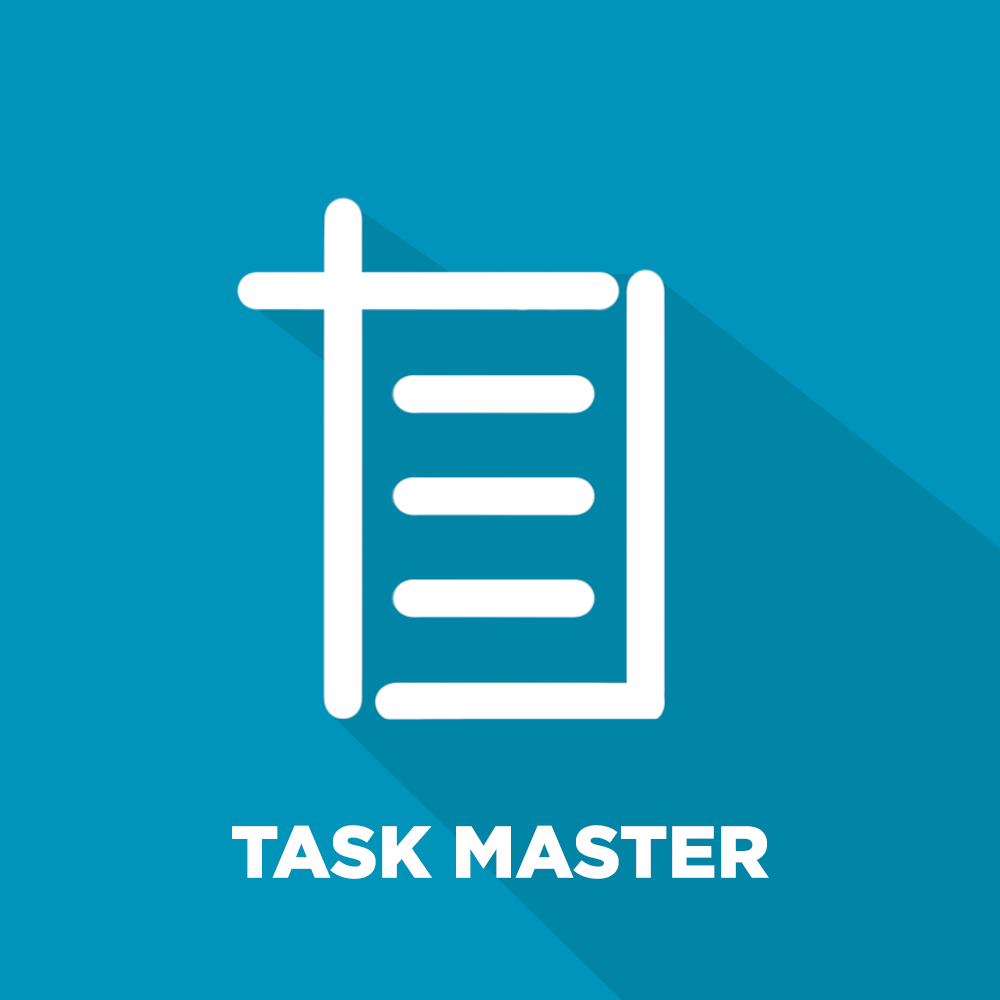
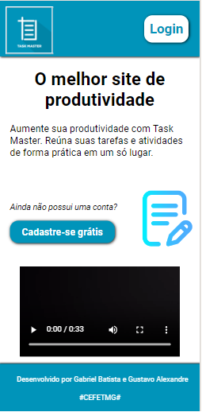
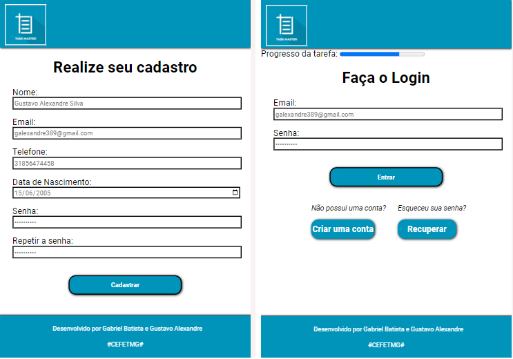

<h1 align="center">Task-Master</h1>

  

<h2>Descrição do projeto</h2>
Taskmaster é uma ferramenta simples e eficaz para o gerenciamento de tarefas mensais. Com ela, você pode cadastrar tarefas específicas para cada mês e marcá-las como concluídas conforme as finaliza. Ideal para quem precisa de uma visão clara e organizada das tarefas ao longo do ano, permitindo um acompanhamento contínuo do progresso.

<h2>Funcionalidades</h2>
Cadastro de Usuário: Permite que novos usuários criem suas contas na plataforma, garantindo acesso personalizado a todas as funcionalidades do sistema.

Login de Usuários: Usuários registrados podem fazer login para acessar sua área exclusiva, onde terão acesso às suas tarefas e configurações pessoais.

Home Page Personalizada: Após o login, os usuários são recebidos com uma mensagem de boas-vindas personalizada, juntamente com um painel de controle que oferece fácil acesso às principais funcionalidades do Taskmaster.

Gerenciamento de Tarefas: Usuários podem cadastrar novas tarefas associando-as ao mês desejado, garantindo uma organização clara e objetiva de suas responsabilidades ao longo do ano.

Marcação de Tarefas Concluídas: Facilidade para marcar tarefas como concluídas, permitindo um acompanhamento eficaz do progresso de cada mês.

Persistência de Dados: Todos os dados dos usuários, incluindo tarefas e preferências, são armazenados de forma segura utilizando LocalStorage e SessionStorage, garantindo que as informações estejam sempre disponíveis mesmo após o fechamento do navegador.
 

<h2>Landing:</h2>

 

<h2>Cadastro e Login: </h2>

